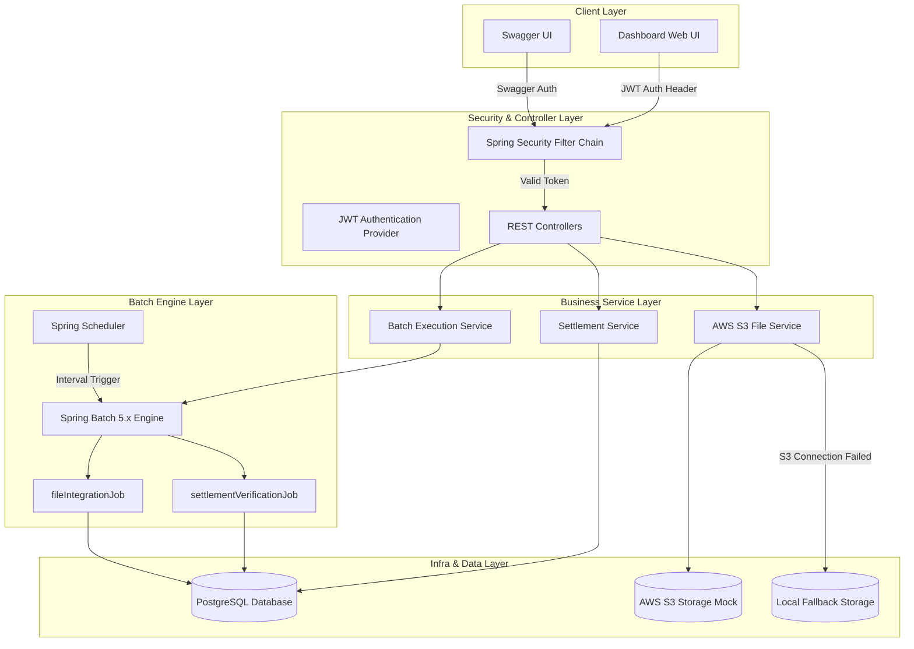
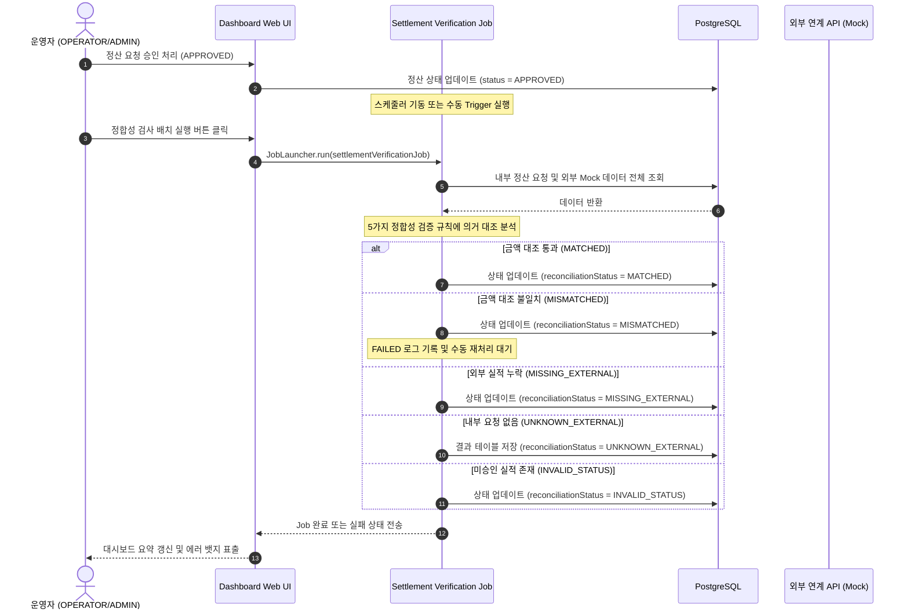

# BizFlow Operations Platform Architecture

본 문서는 BizFlow 업무요청정산증빙 통합 관리 플랫폼의 아키텍처 설계와 연계/배치 처리 및 데이터 정합성 대조(Reconciliation)의 핵심 비즈니스 흐름을 정의합니다.

---

## 1. System Architecture (시스템 구조)

BizFlow 플랫폼은 다수의 외부 기관(금융 결제망 및 공공 데이터 포털)과의 안정적인 파일 연계 및 실시간 REST API 통신을 제어하고 실시간 관제하기 위해 아래와 같이 계층화된 아키텍처를 따릅니다.

---

## 2. Reconciliation Process (정합성 대조 검증 프로세스)

Reconciliation(정합성 대조)은 내부 승인 정산 데이터와 외부 연계 데이터가 완전히 일치하는지 비교 검증하여 자금 흐름의 오류나 누락을 방지하는 핵심 비즈니스 프로세스입니다.

### 정합성 검증 상태 유형 (5대 규칙)
1. **MATCHED**: `APPROVED` 상태의 내부 정산 요청과 외부 실적이 존재하고 금액이 같음.
2. **MISMATCHED**: `APPROVED` 상태의 내부 정산 요청과 외부 실적이 존재하지만 금액이 다름.
3. **MISSING_EXTERNAL**: `APPROVED` 상태의 내부 정산 요청이 존재하지만 외부 실적이 없음.
4. **UNKNOWN_EXTERNAL**: 내부 정산 요청 기록 없이 외부 실적만 존재하는 경우.
5. **INVALID_STATUS**: 내부 정산 요청 상태가 `APPROVED`가 아님(REQUESTED, ASSIGNED 등)에도 외부 실적이 존재하는 경우.

---

## 3. S3 File Upload & Download Fallback (장애 복구 모듈)

외부 인프라(AWS S3)의 장애 상황에서도 연계 프로세스가 마비되지 않고 연속성을 유지할 수 있도록 **자가 치유 Fallback** 메커니즘이 장착되어 있습니다.

* **자가 치유 기능**: AWS S3 버킷 권한 누락이나 인터넷 장애 발생 시 즉각 로컬 디스크의 `./uploads` 경로로 저장 위치가 우회되며, 메타데이터에 파일의 실제 저장 타입(S3_MOCK 또는 LOCAL)이 영속화됩니다. 다운로드 요청 시에도 이 메타데이터를 파악해 최적의 경로에서 바이너리를 안전하게 반환합니다.

---

## 4. 권한별 접근 제어 (Authorization Matrix)

플랫폼 내부 보안을 위해 사용자의 **Role**에 따라 메뉴 조회 및 배치 조작 등의 액션 범위가 엄격하게 분기됩니다.

| Role | 정산 목록 조회 | 신규 정산 등록 | 담당자 배정 | 승인 / 반려 처리 | 배치 수동 기동 | 실패 건 수동 재처리 |
| :--- | :---: | :---: | :---: | :---: | :---: | :---: |
| **ROLE_ADMIN** | O | O | O | O | O | O (전용) |
| **ROLE_OPERATOR** | O | O | O | O | O | X |
| **ROLE_USER** | O (본인 한정) | O (본인 한정) | X | X | X | X |

* **Security Filter**: JWT 유효성을 매 API 호출마다 파싱하여 인증 객체를 생성하고, Spring Security의 `@PreAuthorize` 및 URL 매칭 룰에 의해 인가 처리가 수행됩니다.
