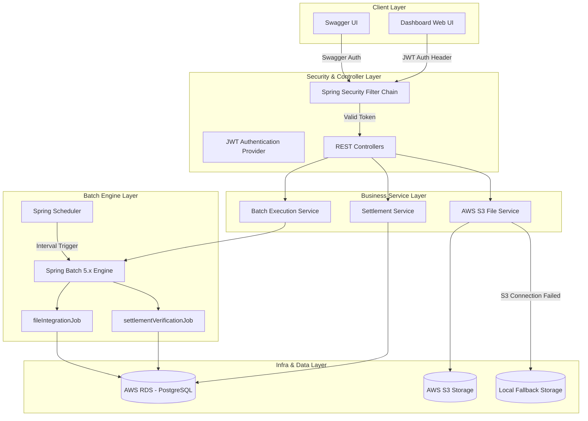
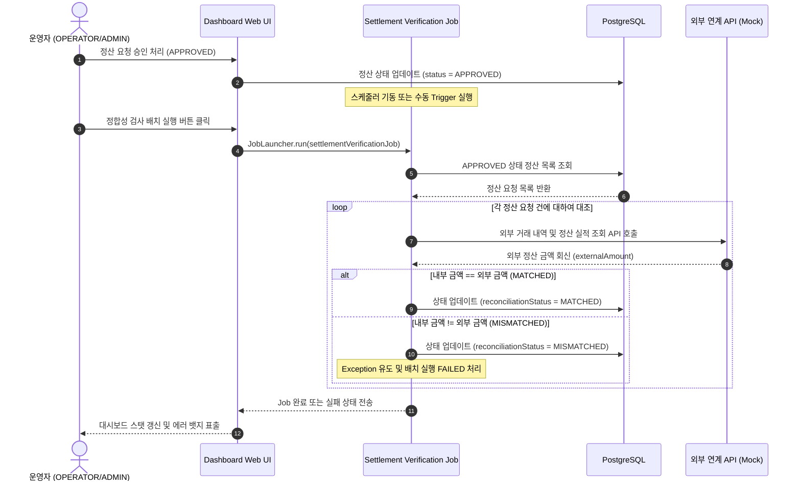
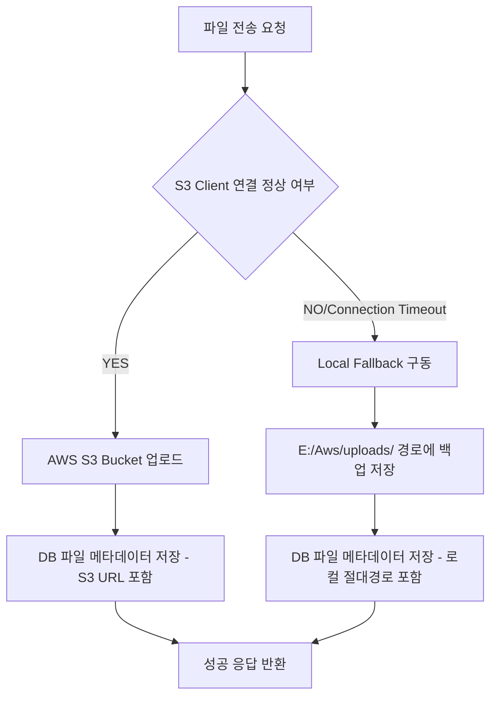

# BizFlow Operations Platform Architecture

본 문서는 BizFlow 업무요청정산증빙 통합 관리 플랫폼의 아키텍처 설계와 연계/배치 처리 및 데이터 정합성 대조(Reconciliation)의 핵심 비즈니스 흐름을 정의합니다.

---

## 1. System Architecture (시스템 구조)

BizFlow 플랫폼은 다수의 외부 기관(은행, 카드사, 행정망 등)과의 안정적인 파일 연계 및 실시간 REST API 통신을 제어하고 실시간 관제하기 위해 아래와 같이 계층화된 클라우드 네이티브 아키텍처를 따릅니다.

---

## 2. Reconciliation Process (정합성 대조 검증 프로세스)

Reconciliation(정합성 대조)은 내부 승인 정산 데이터와 외부 연계 데이터가 완전히 일치하는지 비교 검증하여 자금 흐름의 오류나 누락을 방지하는 핵심 비즈니스 프로세스입니다.

### 정합성 검증 상태 유형
* **UNVERIFIED**: 최초 정산 등록 시 상태이며, 검증 배치가 아직 수행되지 않은 대기 상태입니다.
* **MATCHED**: 내부 정산 요청액과 외부 연계 기관의 실제 거래 금액이 1원 단위까지 완벽하게 일치하여 검증 통과한 상태입니다.
* **MISMATCHED**: 내부 요청액과 외부 금액이 서로 다르거나 거래 정보 불일치가 발생한 장애 상태로, 배치 Job이 에러를 발생시키며 즉시 중단됩니다.

---

## 3. S3 File Upload & Download Fallback (장애 복구 모듈)

외부 인프라(AWS S3)의 장애 상황에서도 연계 프로세스가 마비되지 않고 연속성을 유지할 수 있도록 **자가 치유 Fallback** 메커니즘이 장착되어 있습니다.

* **이메일 및 자격 증명 보안**: AWS 접근 정보가 누락되거나 잘못된 자격 증명이 주입되어도, `S3Config`에서 이를 안전하게 감지하여 더미 클라이언트를 바인딩하고 로컬 Fallback 저장소를 자동 가동시키므로 애플리케이션 시작 장애가 절대 발생하지 않습니다.

---

## 4. 권한별 접근 제어 (Authorization Matrix)

플랫폼 내부 보안을 위해 사용자의 **Role**에 따라 메뉴 조회 및 배치 조작 등의 액션 범위가 엄격하게 분기됩니다.

| Role | 정산 목록 조회 | 신규 정산 등록 | 담당자 배정 | 승인 / 반려 처리 | 배치 수동 기동 및 재처리 |
| :--- | :---: | :---: | :---: | :---: | :---: |
| **ROLE_ADMIN** | O | O | O | O | O |
| **ROLE_OPERATOR** | O | O | O | O | O |
| **ROLE_USER** | O | O | X | X | X |

* **Security Filter**: JWT 유효성을 매 API 호출마다 파싱하여 인증 객체를 생성하고, Spring Security의 `@PreAuthorize` 및 URL 매칭 룰에 의해 인가 처리가 수행됩니다.
